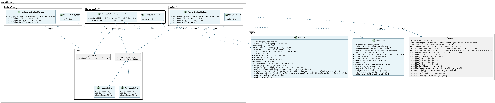

#  Class Diagram - *integradora Discretas II*

##  General Description
This document presents the **class diagram** of the `integradoraDiscretas` project, which implements three **Divide and Conquer algorithms** in **Scala**:

- **Kadane 2D** → Finds the maximum sum of a contiguous submatrix
- **Karatsuba** → Efficient polynomial multiplication
- **MaximumXor** → Finds the pair of numbers with the maximum XOR value

---

##  Class Diagram

---

##  Component Description

###  Package `logic`
Contains the implementations of the three main algorithms.

####  **Kadane**
- **Description:** Implements the maximum submatrix sum algorithm using Divide and Conquer
- **Complexity:** Θ(n²·m), where *n* = rows, *m* = columns
- **Main methods:**
    - `maxSubmatrix()`: Entry point
    - `maxSubRec()`: Recursive implementation
    - `maxCrossing()`: Calculates sums crossing the midpoint
    - `kadane()`: 1D Kadane for subarrays

####  **Karatsuba**
- **Description:** Efficient polynomial multiplication algorithm
- **Complexity:** Θ(n^1.585) (better than Θ(n²))
- **Main methods:**
    - `multiply()`: Entry point, returns cleaned result
    - `karatsuba()`: Recursive implementation
    - `add()`, `subtract()`: Auxiliary operations

#### 🔹 **XorLogic**
- **Description:** Finds pair of numbers with maximum XOR using Divide and Conquer
- **Approach:** Splits numbers by bits and recursively combines results
- **Main methods:**
    - `maxXorPair()`: Entry point
    - `maxXorPairDC()`: Recursive divide & conquer implementation
    - `crossMax()`: Evaluates pairs between partitions
    - `splitByBit()`: Divides list by a given bit position

---

###  Package `workSheets.utils`

####  **JsonReader**
- Reads JSON files containing test cases
- Uses **Circe** for automatic deserialization

####  **Paths**
- Centralizes file paths for test case JSONs
- Contains sub-objects for each algorithm:
    - `KadanePaths`
    - `KaratsubaPaths`
    - `XorPaths`

---

##  Test Packages
Each algorithm includes two categories of tests:

###  Scalability Tests (`*RunScalabilityTest`)
- Execute **Small**, **Medium**, and **Large** test cases
- Load data from JSON files
- Validate algorithm correctness at scale

###  Toy Tests (`*RunToyTest`)
- Simple unit tests for basic functionality and edge cases
- Useful for quick debugging and verifying helper functions

---

##  Design Patterns

###  Functional Programming
- **Tail recursion** (`@tailrec`) for iteration
- **Immutability:** all functions are pure
- **No mutable state** or side effects

### ⚙ Divide and Conquer
All main algorithms follow the same structure:
1. **Divide** → Split the input problem
2. **Conquer** → Recursively solve subproblems
3. **Combine** → Merge partial solutions

###  Separation of Concerns
- Algorithm logic is separated from test logic
- Reusable utilities (`JsonReader`, `Paths`) in an independent package
- Tests organized by **type** (Toy vs Scalability)

---

##  Implementation Notes
- **Language:** Scala 3 (modern syntax with indentation)
- **Testing Framework:** ScalaTest
- **JSON Parsing:** Circe
- **Optimization:** Tail recursion to prevent stack overflow

---

##  Relationships
- Each test class depends on its corresponding algorithm class
- Scalability tests depend on `JsonReader` and `Paths` for loading JSON data
- `Paths` aggregates subpaths for each algorithm
- All implementations follow **pure functional programming** with **no external dependencies**
